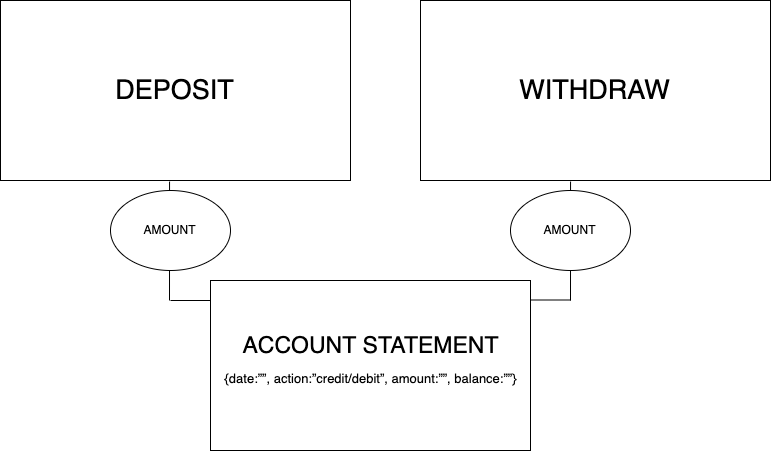

# Bank-Tech-Test

## Setup RSpec:
```bundle init```

In gemfile: ```gem ‘rspec’```

```bundle install```

```rspec —init```
    
## Setup Rubocop:
In gemfile: ```gem ‘rubocop’```

Add .rubocop.yml to root folder from https://github.com/makersacademy/scaffolint

```bundle install```
    
## Summary:
I started writing test to implement the simplest feature to keep track of the balance, I added two other tests and features for deposit money and withdraw money from balance, considering one possible edge case(withdrawing more than the balance) raising an error in that case, to let the client know that the action is not possible.
I implemented a print statement method refactoring the code and added a date for each transaction.
I refactored the code extracting a transaction class to do the calculation for the transaction

## User Stories:
1. As a user, so I can know how much is my bank balance, I would like to be able to print out my account balance.
2. As a user, so I can add money to my balance, I would like to be able to deposit an amount.
3. As a user, so I can take money from my balance, I would like to be able to withdraw an amount.
4. As a user, so I can know the statement of my account, I would like to be able to print out the statement in details with deposit or withdraw I did. (This need to be split in smaller steps) 
  * Add deposit action and amount to statement
  * Add withdraw action and amount to statement
  * Add final balance to statement
5. As a user, so I can know when I deposited or withdraw money, I would like to be able to see a date of my transaction in my printed statement.
6. As a user, so I cannot withdraw more than what I have, I would like to see a message if I try 


